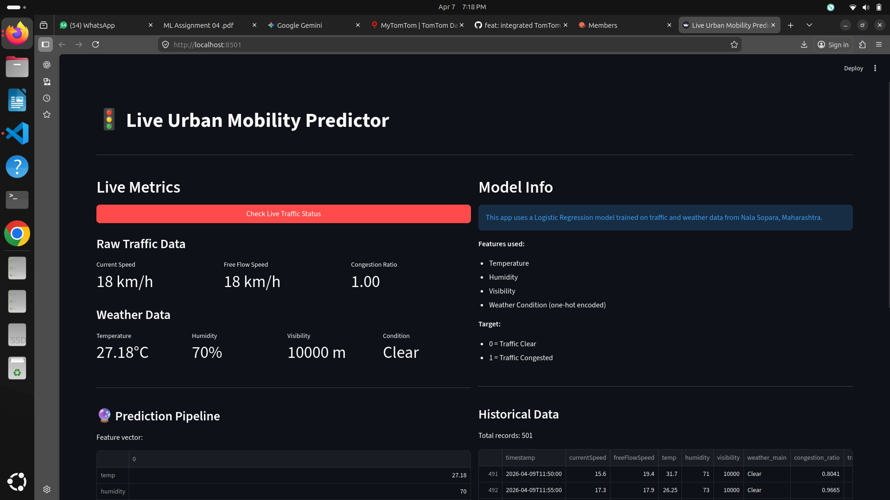
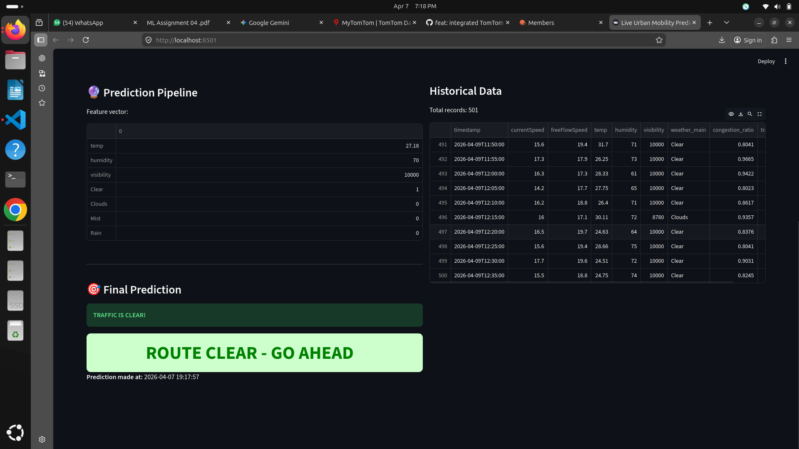

# Urban Mobility ML


## Overview

**Urban Mobility ML** is a real-time traffic prediction system that uses sensor fusion to combine live traffic and weather data to predict congestion levels. The system fetches data from TomTom Traffic API and OpenWeatherMap API, processes it using mathematical models, and provides predictions via an interactive Streamlit dashboard.

The core innovation is combining multiple data sources:
- **TomTom Traffic API**: Provides real-time current speed and free-flow speed
- **OpenWeatherMap API**: Provides temperature, humidity, visibility, and weather conditions

These features are fused to predict whether the traffic is **Clear (0)** or **Congested (1)**.

## Lab Outcomes Mapped

This project covers all required lab outcomes:

| Outcome | Description | Implementation |
|---------|------------|--------------|
| **LO1** | Data Preprocessing | Dropping missing values, feature engineering |
| **LO2** | Mathematical Modeling | Congestion ratio calculation: `currentSpeed / freeFlowSpeed` |
| **LO3** | Linear Regression | Logistic Regression classification |
| **LO4** | Clustering | Gaussian Mixture Model (EM algorithm) |
| **LO5** | Neural Networks | Single Layer Perceptron (MLPClassifier) |
| **LO6** | Dimensionality Reduction | PCA (n_components=2) |

## Tech Stack

### APIs
- [TomTom Traffic API](https://developer.tomtom.com/traffic-api) - Real-time traffic flow data
- [OpenWeatherMap API](https://openweathermap.org/api) - Weather data

### Libraries
- **Data Fetching**: `requests`, `python-dotenv`
- **Data Processing**: `pandas`, `numpy`
- **Machine Learning**: `scikit-learn`
- **Dashboard**: `streamlit`
- **Model Export**: `joblib`

## Project Structure

```
Urban_Mobility_ML/
├── .env                    # API keys (not committed)
├── 01_data_fetcher.py       # Fetch live data from APIs
├── 02_preprocessing.py    # Clean data & create features
├── 02b_generate_mock_data.py  # Generate synthetic training data
├── 03_model_training.py  # Train ML models (LO3-LO6)
├── app.py                # Streamlit dashboard
├── models/
│   ├── traffic_model.pkl  # Trained classifier
│   └── scaler.pkl         # Fitted StandardScaler
├── data/
│   ├── live_traffic.csv    # Raw data
│   └── processed_traffic.csv # Cleaned data
└── README.md
```

## Run Instructions

### 1. Clone the Repository

```bash
git clone https://github.com/YashKasare21/Urban_Mobility_ML.git
cd Urban_Mobility_ML
```

### 2. Create Virtual Environment

```bash
python3 -m venv venv
source venv/bin/activate  # Linux/Mac
# or
venv\Scripts\activate   # Windows
```

### 3. Install Dependencies

```bash
pip install -r requirements.txt
```

Or install individually:

```bash
pip install requests pandas numpy scikit-learn streamlit python-dotenv joblib
```

### 4. Configure API Keys

Create a `.env` file in the project root:

```env
TOMTOM_API_KEY=your_tomtom_api_key_here
OPENWEATHER_API_KEY=your_openweather_api_key_here
```

Get free API keys from:
- TomTom: https://developer.tomtom.com/
- OpenWeatherMap: https://openweathermap.org/api

### 5. Generate Training Data

```bash
# First fetch real data
python3 01_data_fetcher.py

# Then generate synthetic data for training
python3 02b_generate_mock_data.py

# Preprocess the data
python3 02_preprocessing.py
```

### 6. Train Models

```bash
python3 03_model_training.py
```

### 7. Run the Dashboard

```bash
streamlit run app.py
```

The dashboard will open at `http://localhost:8501`.

## Usage

1. Open the Streamlit dashboard
2. Click **"Check Live Traffic Status"**
3. View real-time traffic and weather metrics
4. See the congestion prediction (Clear or Jam)

## Screenshots


*Live Urban Mobility Dashboard with real-time metrics*


*Traffic prediction result - Clear or Congested*

## Model Performance

The best performing model (Logistic Regression or MLP Perceptron) is automatically saved to `models/traffic_model.pkl`. The scaler is saved to `models/scaler.pkl` for consistent feature transformation during inference.

## License

MIT License - See [LICENSE](LICENSE) for details.

## Author

Built for Urban Mobility Analysis - Nala Sopara, Maharashtra